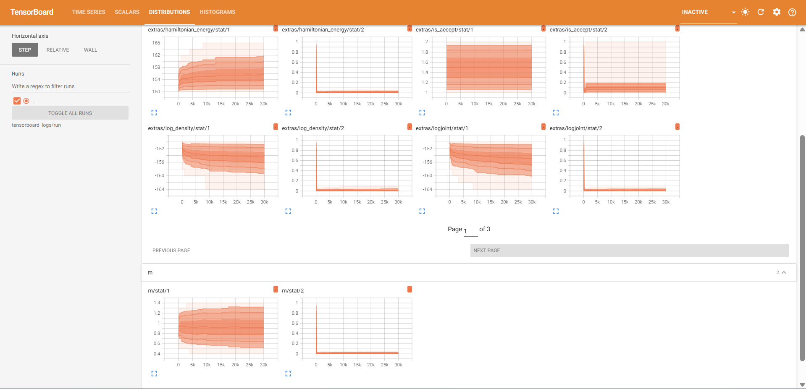

# Callbacks

AbstractMCMC provides a unified callback API for monitoring and logging MCMC sampling.

## Basic Usage

The `mcmc_callback` function is the main entry point for creating callbacks:

```julia
using AbstractMCMC

struct MyModel <: AbstractMCMC.AbstractModel end

struct MySampler <: AbstractMCMC.AbstractSampler end

function AbstractMCMC.step(rng, ::MyModel, ::MySampler, state=nothing; kwargs...)
   # all samples are zero
   return 0.0, state
end

model, sampler = MyModel(), MySampler()

# Simple callback with a function
cb = mcmc_callback() do rng, model, sampler, transition, state, iteration
    println("Iteration: $iteration")
end

chain = sample(model, sampler, 10; callback=cb)
```

## Combining Multiple Callbacks

Pass multiple callbacks to `mcmc_callback` to combine them:

```julia
cb1 = (args...; kwargs...) -> println("Callback 1")
cb2 = (args...; kwargs...) -> println("Callback 2")

cb = mcmc_callback(cb1, cb2)
```

You can also add callbacks dynamically using `BangBang.push!!`:

```julia
using BangBang

cb = mcmc_callback(cb1)
cb = push!!(cb, cb2)
```

## TensorBoard Logging

TensorBoard logging requires `TensorBoardLogger`. Statistics collection also requires `OnlineStats`.

### Basic Logging (No Statistics)

```julia
using AbstractMCMC
using TensorBoardLogger

logger = TBLogger("runs/experiment1")
cb = mcmc_callback(logger=logger)

chain = sample(model, sampler, 1000; callback=cb)
```

### Logging with Statistics

To collect running statistics (mean, variance, histograms), load `OnlineStats` and use the `stats` argument:

```julia
using AbstractMCMC
using TensorBoardLogger
using OnlineStats

logger = TBLogger("runs/experiment1")

# Use default statistics (Mean, Variance, KHist)
cb = mcmc_callback(logger=logger, stats=true)

# Or specify custom statistics
cb = mcmc_callback(
    logger=logger,
    stats=(Mean(), Variance(), KHist(50)),
)
```

!!! note
    If you request statistics without loading `OnlineStats`, you will get a helpful error:
    `"Statistics collection requires OnlineStats.jl. Please load OnlineStats before enabling statistics."`

### Stats Processing Options

Control how samples are processed before computing statistics with `stats_options`:

```julia
cb = mcmc_callback(
    logger=logger,
    stats=true,
    stats_options=(
        skip=100,    # Skip first 100 samples (burn-in)
        thin=5,      # Use every 5th sample
        window=1000, # Rolling window of 1000 samples
    ),
)
```

Options merge with defaults, so you only need to specify what you want to change:

```julia
# Only change thin, skip and window use defaults (0 and typemax(Int))
cb = mcmc_callback(logger=logger, stats=true, stats_options=(thin=10,))
```

### Name Filtering

Use `name_filter` to control which parameters and statistics are logged:

```julia
cb = mcmc_callback(
    logger=logger,
    name_filter=(
        include=["mu", "sigma"],  # Only log these parameters
        exclude=["_internal"],     # Exclude matching names
        extras=true,               # Include extra stats (log density, etc.)
        hyperparams=true,          # Include hyperparameters (logged once)
    ),
)
```

### Complete Example

```julia
using AbstractMCMC
using TensorBoardLogger
using OnlineStats

logger = TBLogger("runs/full_example")

cb = mcmc_callback(
    logger=logger,
    stats=true,
    stats_options=(skip=50, thin=2),
    name_filter=(
        exclude=["_internal"],
        extras=true,
        hyperparams=true,
    ),
)

chain = sample(model, sampler, 10000; callback=cb)
```

Then view in TensorBoard:
```bash
tensorboard --logdir=runs/full_example
```

Navigate to `localhost:6006` in your browser to see the dashboard. You'll see real-time plots of your parameter distributions, histograms, and other statistics as sampling progresses.


*The Time Series tab provides detailed traces of parameter values throughout the sampling process.*


*The Scalars tab shows time series of parameter values and statistics over the sampling iterations.*



*The Distributions tab displays the marginal distributions of each parameter.*


*The Histograms tab shows the evolution of parameter distributions over time.*

## API Reference

### Main Functions

```@docs
mcmc_callback
```

## Default Values

### stats_options defaults

| Option   | Default        | Description                    |
|----------|----------------|--------------------------------|
| `skip`   | `0`            | Skip first n samples (burn-in) |
| `thin`   | `0`            | Use every nth sample (0=all)   |
| `window` | `typemax(Int)` | Window size for rolling stats  |

### name_filter defaults

| Option       | Default    | Description                      |
|--------------|------------|----------------------------------|
| `include`    | `String[]` | Only log these (empty=all)       |
| `exclude`    | `String[]` | Don't log these                  |
| `extras`     | `false`    | Include extra stats              |
| `hyperparams`| `false`    | Include hyperparameters          |

## Implementing Custom Callbacks

Any callable with the following signature can be used as a callback:

```julia
function my_callback(rng, model, sampler, transition, state, iteration; kwargs...)
    # Your callback logic here
end
```

## names_and_values - Public API

```@docs
AbstractMCMC.names_and_values
```

### Overriding for Your Package

```julia
function AbstractMCMC.names_and_values(
    model::MyPackage.MyModel, sampler, transition, state;
    params=true, stats=false, hyperparams=false, extras=false
)
    iters = []
    
    if params
        # Return actual variable names
        push!(iters, [
            "μ" => state.mu,
            "σ" => state.sigma,
        ])
    end
    
    if stats
        s = getstats(state)
        push!(iters, (string(k) => v for (k, v) in pairs(s)))
    end
    
    if hyperparams
        push!(iters, ["step_size" => sampler.step_size])
    end
    
    return Iterators.flatten(iters)
end
```

### Usage in TensorBoard Callback

The TensorBoard callback uses `names_and_values` internally:

```julia
for (k, val) in names_and_values(model, sampler, t, state; params=true, stats=true)
    @info "$k" val
end
```

## Internals

!!! note
    These types and methods are used internally. They are not part of the public API and 
    may change or break at any time without notice.

### Types

```@docs
AbstractMCMC.MultiCallback
AbstractMCMC.NameFilter
```

### OnlineStats Wrappers

When using statistics, AbstractMCMC provides wrappers that modify how samples are processed:

| Wrapper | Description |
|---------|-------------|
| `Skip(n, stat)` | Skip first `n` observations before fitting `stat` |
| `Thin(n, stat)` | Only fit every `n`-th observation to `stat` |
| `WindowStat(n, stat)` | Use a rolling window of `n` observations |

These are applied automatically via `stats_options`, but can also be used directly if needed.
